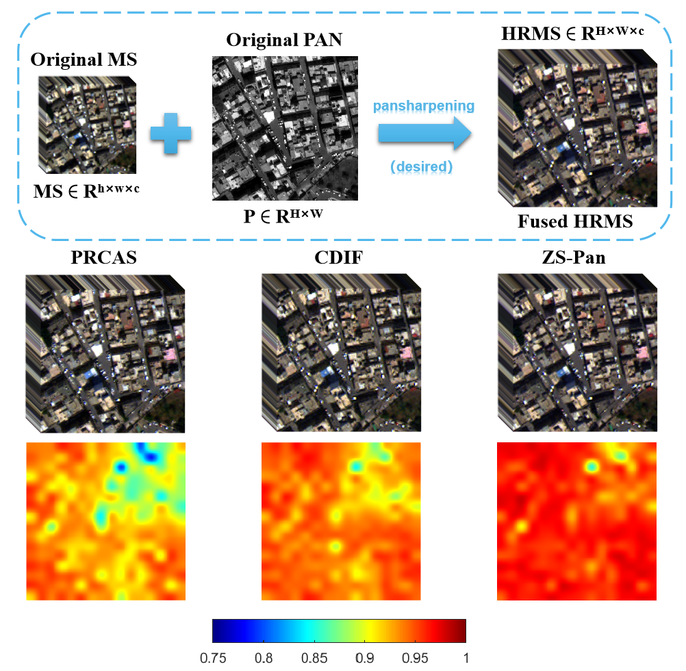
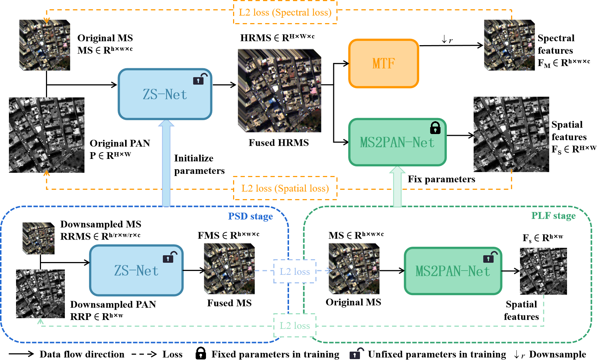
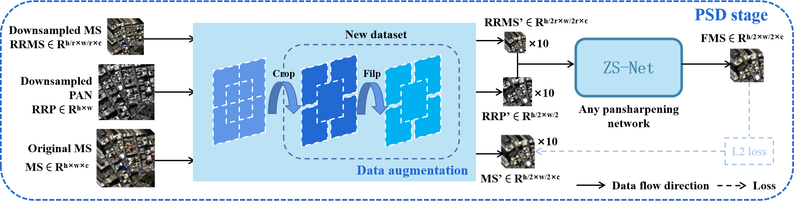
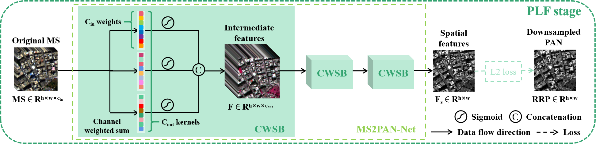
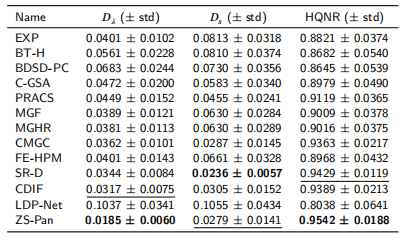
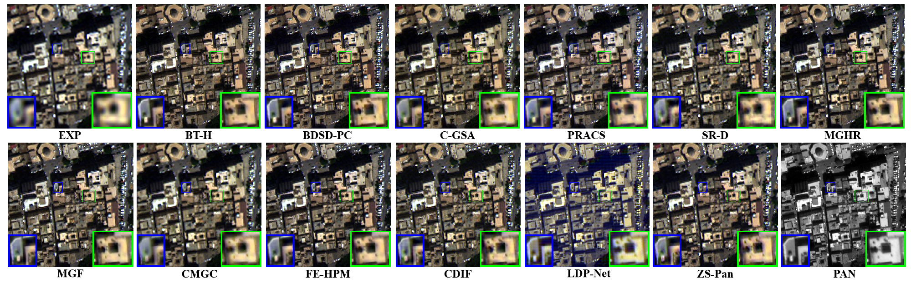

# Zero-shot Semi-supervised Learning for Pansharpening
- Code for the paper: "Zero-shot Semi-supervised Learning for Pansharpening", Information Fusion.
- Zero-shot pansharpening (ZS-Pan) only requires a single pair of PAN/LRMS images to train the network.
- Any pansharpening network can take the ZS-Pan as a plug-and-play module.
- A two-phase three-component semi-supervised model is designed for ZS-Pan.
- State-of-the-art (SOTA) performance on the [PanCollection](https://github.com/liangjiandeng/PanCollection) of remote sensing pansharpening.

## Method
### pansharpening

Pansharpening is a challenging low-level vision task whose aim is to fuse LRMS (low-resolution multispectral image) and PAN (panchormatic image) to get HRMS (high-resolution multispectral image).
### ZS-Pan
#### Overall Structure

The ZS-Pan framework is built with three-dependent stages, i.e., the reduced-resolution supervised pre-training (RSP), the spatial degradation establishment (SDE), and the full-resolution unsupervised generation (FUG) stages.
#### RSP

The flowchart of the RSP stage. "×𝑁" is the multiplicative factor due to data augmentation.
#### SDE

The flowchart of the SDE stage. 𝑐𝑖𝑛 and 𝑐𝑜𝑢𝑡 denote the number of channels before and after the CWSB, respectively
## Experiment results
- Quantitative evalutaion results on WV3 datasets of PanCollection.

- Visual results on WV3 datasets (full resolution) of PanCollection.

# Get Strarted
## Dataset
- Datasets for pansharpening: [PanCollection](https://github.com/liangjiandeng/PanCollection). The downloaded data can be placed everywhere because we do not use relative path. Besides, we recommend the h5py format, as if using the mat format, the data loading section needs to be rewritten.
## Denpendcies
- Python  3.8.2 (Recommend to use Anaconda)
- Pytorch 2.0
- NVIDIA GPU + CUDA
- Python packages: pip install numpy scipy h5py torchsummary
## Code
Training and testing codes are in the current folder.
- The code for training is in main_xxx.py (three stages), while the code for testing test.py.
- For training, you need to set the file_path in the main function, adopt t your train set, validate set, and test set as well. Our code train the .h5 file, you may change it through changing the code in main function.
- RSP and SDE stages should be trained before FUG stage, while they can be trained simutaneously. 
- As for testing, you need to set the path in both main and test function to open and load the file.
- A trained model for a single WV3 full resolution image is attached along the code.
# Citation
> @article{CAO2024102001,
>  title = {Zero-shot semi-supervised learning for pansharpening},
>  journal = {Information Fusion},
>  volume = {101},
>  pages = {102001},
>  year = {2024},
>  issn = {1566-2535},
>  doi = {https://doi.org/10.1016/j.inffus.2023.102001},
>  url = {https://www.sciencedirect.com/science/article/pii/S1566253523003172},
>  author = {Qi Cao and Liang-Jian Deng and Wu Wang and Junming Hou and Gemine Vivone}
> }
# Contact
We are glad to hear from you. If you have any questions, please feel free to contact caolucas082@gmail.com.
